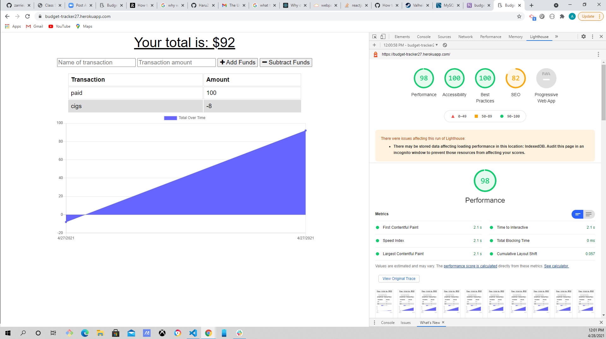
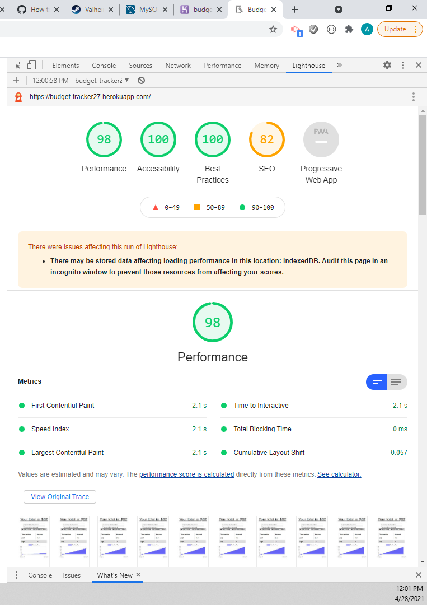

# <h1 align="center"> Online/Offline Budget Trackers</h1>

## Badges
    

## Description

    The user will be able to add expenses and deposits to their buudget with or without a connection.  When entering transactions offline, they should populate the total when brought back online.  

 

## Table of Contents

- [Description](#description)
- [Installation](#installation)
- [Usage](#usage)
- [License](#license)
- [Contributing](#contributing)
- [Tests](#tests)
- [Questions](#questions)

## Installation

    The user can visit the heroku app link or go to the github repository and clone it do npm i && npm start in the terminal command line.

## Usgae

    As an avid traveller I want to be able to track my withdrawls and deposits with or without a data/internet connection so that my account balance is accurate when I am traveling also giving users a fast way to track their money is important, but allowing them to access that information anytime is even more important.  Having offline functionality is paramount to our applications success.   

## Contribution

    Tyler G., Eiman Z., Lee S. 

## License

  This application uses the MPL-2.0 license, click on the badge to see the legal notice.  

## Test

    One can test this app by opening the console and going offline in the network tab.  Then you can still add and subtract the funds and once you reconnect you can update the information given.

## Questions

    If you have any questions please feel free to email me or contact me on Github.  My email is saeediarash84@gmail.com, my github username is Haru2727, follow the links below for them.

<a href="mailto:saeediarash84@gmail.com">Email</a>
[Github](https://github.com/Haru2727)
[HEROKU LINK](https://budget-tracker27.herokuapp.com/)

